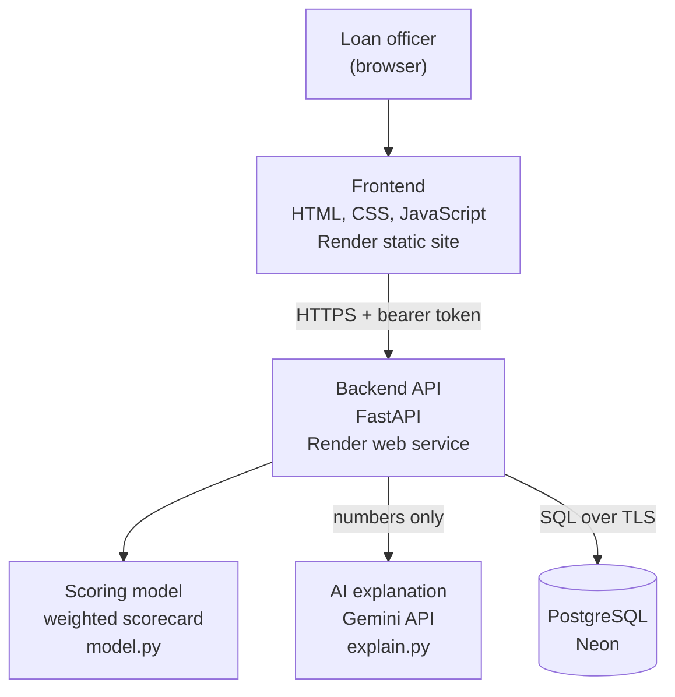

# Credit risk assessment for borrowers without a credit file

A working prototype for **AI-Powered Financial Inclusion: Dynamic Risk Assessment for Underserved Segments**. It scores a borrower who has no credit history from five everyday financial signals, shows how much each signal contributed, and has an AI write a short plain-language explanation, so a loan officer can explain the decision.

Author: Souvik Mondal

## Live demo

| | Link |
|---|---|
| Web app | https://credit-risk-app-yhpd.onrender.com |
| API and interactive docs | https://credit-risk-api-4i8w.onrender.com/docs |
| Source code | https://github.com/f20230861-Svk/credit-risk-assessment |

The app needs a login. The demo username and password are in the submission email, and are deliberately not written in this public repository.

The servers run on a free plan and sleep when idle. **The first request after a quiet period can take up to a minute.** Open the web app a couple of minutes before a demo.

## What it does

1. A loan officer signs in.
2. They enter five signals for a borrower, or pick one of three example borrowers.
3. The API returns a score out of 100, a risk band (Low, Medium or High), and the points each signal added.
4. An AI (a large language model) turns the numbers into a short plain-language explanation: which signals helped, which held the score back, and how far the borrower is from the next band. If the AI is unavailable, the app shows a built-in explanation instead.
5. Every assessment is saved to a PostgreSQL database and shown in a history table.

## Architecture



| Layer | Technology | Where it lives |
|---|---|---|
| Frontend | HTML, CSS and JavaScript, no framework | `frontend/index.html`, hosted on Render (static site) |
| Backend API | Python, FastAPI, Pydantic validation | `backend/main.py`, hosted on Render (web service) |
| Scoring | Weighted scorecard, per-signal breakdown | `backend/model.py` |
| AI explanation | LLM (Google Gemini API), optional, with a built-in fallback | `backend/explain.py` |
| Database | PostgreSQL on Neon | `backend/database.py` |
| Authentication | Signed JWT tokens (PyJWT) | `backend/main.py` |
| Tests | pytest, 44 tests | `backend/test_model.py`, `backend/test_auth.py`, `backend/test_explain.py` |

How a request flows:

1. The browser sends the username and password to `POST /login` and receives a token that lasts 12 hours.
2. The browser sends the five signals to `POST /assess-risk` with the token.
3. The API checks the token, validates the inputs, computes the score, and saves the assessment to Postgres. It then asks the AI for a short explanation, sending only the numbers behind the score, and returns the result with its breakdown and the explanation.
4. `GET /history` returns recent assessments, again only with a valid token.

## How the score works

The score is a weighted sum of five signals. Four are scored 0 to 100 by the input, and income is converted to a 0 to 100 score first.

| Signal | What it captures | Weight | Maximum points |
|---|---|---|---|
| Transaction regularity | How steadily money moves through the account | 30% | 30 |
| Utility bill payments | On-time payment of electricity, water, gas and phone bills | 25% | 25 |
| Monthly income | Average monthly inflow in rupees | 20% | 20 |
| Mobile usage stability | Consistency of recharge and usage patterns | 15% | 15 |
| Social signal | Community and network signals | 10% | 10 |

- **Income score** = `min(monthly income / ₹50,000, 1) × 100`. Income of ₹50,000 or more earns full points.
- **Risk bands:** 70 and above is Low Risk, 40 to below 70 is Medium Risk, below 40 is High Risk.

Worked example, a steady earner with signals 85, 90, ₹42,000, 80 and 70:
25.5 + 22.5 + 16.8 + 12 + 7 = **83.8, Low Risk**.

The model is an **interpretable weighted scorecard with hand-set weights**, not a machine-learning model trained on repayment data. That is a deliberate choice for the prototype: every point of the score can be traced to an input, which is what a lender needs to explain a decision. See the next steps below for how it would become a trained model.

### The AI explains the score, it never decides it

The score and the band always come from the scorecard. The AI layer (`backend/explain.py`) receives only the numbers behind the score, meaning the points each signal earned and the values entered, with no names or identifiers. It writes 2 to 3 sentences for the loan officer. The prompt tells it not to change the score and not to recommend approving or rejecting a loan. The rest of the safeguards are in code:

- The AI only ever sees a copy of the result, so it cannot alter the saved or returned score.
- If the AI is off, slow (over 8 seconds), rate-limited or returns something unusable, the assessment still succeeds and the app shows its built-in explanation.
- The text is length-limited and displayed as plain text, never as HTML.
- The page labels an AI-written explanation as such.

## API

| Method | Path | Sign-in needed | Purpose |
|---|---|---|---|
| GET | `/` | No | Health check |
| POST | `/login` | No | Exchange username and password for a token |
| POST | `/assess-risk` | Yes | Score a borrower and save the assessment |
| GET | `/history?limit=20` | Yes | Recent assessments, newest first (limit 1 to 100) |

`/assess-risk` returns `final_score`, `risk_band`, `breakdown` and `ai_explanation`. The last is `null` when the AI layer is off or unavailable.

Inputs to `/assess-risk`: `txn_regularity`, `utility_payment_score`, `mobile_usage_stability` and `social_signal_score` (each 0 to 100), and `avg_monthly_inflow` (0 or more). Anything else returns a 422 error.

## Security

- **No secrets in the code.** The database address, the login, and the token-signing key are read from environment variables. `.env` is git-ignored. `backend/.env.example` lists the names without values.
- **Protected endpoints.** `/assess-risk` and `/history` return 401 without a valid, unexpired token, because assessments contain applicants' financial details.
- **Tokens** are signed with HS256 and expire after 12 hours. Passwords are compared in constant time.
- **Fails closed.** If the login settings are missing, the server refuses to sign anyone in (503) instead of using defaults.
- **Input validation** with Pydantic on every request.
- **CORS** is restricted to the frontend's address in production through `ALLOWED_ORIGINS`.
- **Encrypted in transit:** the web app and API use HTTPS, and the database connection requires TLS.
- **Minimal data to the AI service.** Only numbers are sent, never names or identifiers. The API key is sent in a request header, not in a web address, so it never appears in logs. The free tier of the AI service may use prompts to improve the provider's products, which is one more reason to keep the request to anonymous numbers.

## Run it locally

You need Python 3.9 or newer and a PostgreSQL database. A free Neon database works.

```bash
git clone https://github.com/f20230861-Svk/credit-risk-assessment.git
cd credit-risk-assessment/backend
python3 -m venv venv
source venv/bin/activate
pip install -r requirements.txt
cp .env.example .env        # then open .env and fill in your own values
uvicorn main:app --reload
```

The API is now at http://127.0.0.1:8000, with interactive docs at `/docs`.

For the frontend, open `frontend/index.html` and set `API_URL` near the top of the script to `"http://127.0.0.1:8000"`, then open the file in a browser.

### Settings

| Name | Purpose |
|---|---|
| `DATABASE_URL` | PostgreSQL connection string |
| `AUTH_USERNAME`, `AUTH_PASSWORD` | The account allowed to sign in |
| `JWT_SECRET` | Long random string used to sign tokens |
| `ALLOWED_ORIGINS` | Optional. Comma-separated websites allowed to call the API. Defaults to any |
| `GEMINI_API_KEY` | Optional. Key from Google AI Studio. Without it the AI explanation is off and the app uses its built-in one |
| `GEMINI_MODEL` | Optional. Defaults to `gemini-3.5-flash-lite` |

## Tests

```bash
cd backend
pip install -r requirements-dev.txt
python -m pytest -q
```

44 tests cover the scoring model (worked examples, band boundaries, income cap, breakdown adding up to the score), authentication (missing, wrong, expired and forged tokens; wrong passwords; input validation), and the AI explanation (fallback on every failure, key never in the URL, prompt contents, the AI unable to change the score). The tests replace the database and the AI service with stand-ins, so they never touch real data or make real calls.

## Deployment

- **Database:** a Neon PostgreSQL project. The API creates the `assessments` table on startup.
- **Backend:** a Render web service with root directory `backend`, build command `pip install -r requirements.txt`, start command `uvicorn main:app --host 0.0.0.0 --port $PORT`, and the settings above as environment variables (`GEMINI_API_KEY` is optional).
- **Frontend:** a Render static site with publish directory `frontend`.
- Both services redeploy automatically when `main` is updated.

## Limitations and next steps

**Prototype limits**
- The five signals are entered by hand. A real system would derive them from consented data such as bank and UPI transactions, utility and telecom records.
- There is one shared demo account, with its password held in an environment variable. A production version would keep hashed passwords in a users table, with roles and a limit on login attempts.

**AI explanation**
- It depends on a free-tier API with strict rate limits, so under heavy use most explanations would fall back to the built-in one. A production version would use a paid tier, a model approved for the lender, and a data-processing agreement.
- The AI's wording is checked only for length and presence. A production version would also check that every number it quotes matches the scorecard.
- Vector search and retrieval are not used. Nothing in this problem needed them, and they would be the next addition once there is a knowledge base, such as lender policy documents.

**From scorecard to trained model**
- Collect labelled repayment outcomes, then train and compare a logistic regression and a gradient-boosted model against this scorecard.
- Keep explanations, for example with SHAP values, so the per-signal breakdown survives the move to a trained model.
- Calibrate the scores to real default rates, and monitor for drift after launch.

**Fairness and privacy**
- Test every signal, especially the social signal, for bias against groups the lender must treat fairly.
- Obtain informed consent for alternative data and follow the applicable data-protection and digital-lending rules, for example India's DPDP Act.

## Repository layout

```
backend/
  main.py             API endpoints, login and token checks
  model.py            scoring model
  database.py         PostgreSQL connection and queries
  test_model.py       tests for the scoring model
  explain.py          optional AI-written explanation, with fallback
  test_auth.py        tests for sign-in and token checks
  test_explain.py     tests for the AI explanation
  requirements.txt    packages the deployed API needs
  requirements-dev.txt  extra packages for running the tests
  .env.example        the settings the API reads, without values
frontend/
  index.html          the web app
```

## How this was built

I built this with an AI assistant (Claude) to help write and debug the code, and I set up the accounts, ran and tested each part, and deployed it myself. Design decisions, such as choosing an explainable scorecard over an opaque model, are explained above.
